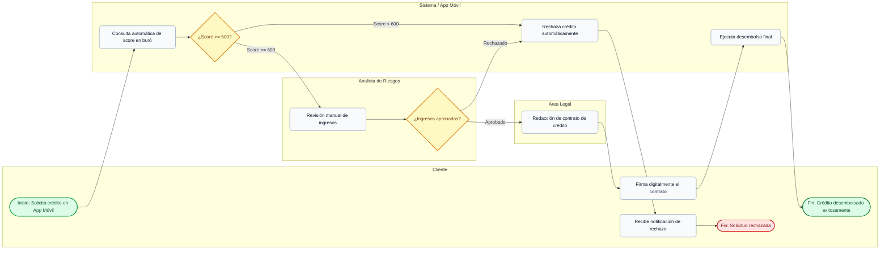

```mermaid
graph LR
    classDef standard fill:#f8fafc,stroke:#94a3b8,stroke-width:1.5px,color:#0f172a,rx:8,ry:8;
    classDef startNode fill:#dcfce7,stroke:#16a34a,stroke-width:2px,color:#14532d,rx:20,ry:20;
    classDef endNode fill:#fee2e2,stroke:#dc2626,stroke-width:2px,color:#7f1d1d,rx:20,ry:20;
    classDef endSuccess fill:#dcfce7,stroke:#15803d,stroke-width:2px,color:#14532d,rx:20,ry:20;
    classDef decision fill:#fef9c3,stroke:#d97706,stroke-width:2px,color:#713f12;

    subgraph CLI["Cliente"]
        C1(["Inicio: Solicita crédito en App Móvil"]):::startNode
        C2["Recibe notificación de rechazo"]:::standard
        C3["Firma digitalmente el contrato"]:::standard
        C_END_REC(["Fin: Solicitud rechazada"]):::endNode
        C_END_EXITO(["Fin: Crédito desembolsado exitosamente"]):::endSuccess
    end

    subgraph SYS["Sistema / App Móvil"]
        S1["Consulta automática de score en buró"]:::standard
        D1{"¿Score >= 600?"}:::decision
        S2["Rechaza crédito automáticamente"]:::standard
        S3["Ejecuta desembolso final"]:::standard
    end

    subgraph RIE["Analista de Riesgos"]
        R1["Revisión manual de ingresos"]:::standard
        D2{"¿Ingresos aprobados?"}:::decision
    end

    subgraph LEG["Área Legal"]
        L1["Redacción de contrato de crédito"]:::standard
    end

    C1 --> S1
    S1 --> D1
    D1 -- "Score < 600" --> S2
    D1 -- "Score >= 600" --> R1
    S2 --> C2
    C2 --> C_END_REC
    R1 --> D2
    D2 -- "Rechazado" --> S2
    D2 -- "Aprobado" --> L1
    L1 --> C3
    C3 --> S3
    S3 --> C_END_EXITO
```
